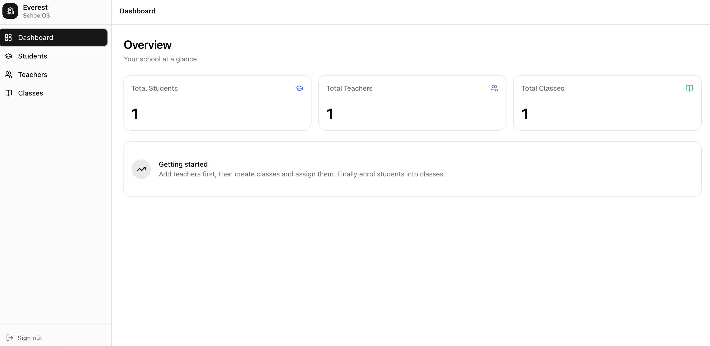

# Student API 

## Project Overview

**Student API** is a full-stack project that helps manage student, teacher and class information. It supports CRUD operations (Create, Read, Update, Delete) for students, teachers and classes with a React frontend for easy interaction.



## Motivation

This is my first backend Go project! I made it to learn Go while building something practical it is a simple API that manages student info like name, email and age. No AI was used in building backend of this project.

I also built a React frontend to visualize and interact with the data, making it a complete full-stack application.

## What is it and what can it do?

It's a full-stack CRUD application that lets you:
- Create, read, update, and delete students
- Create, read, update, and delete teachers
- Create, read, update, and delete classes
- Associate students with teachers and classes
- View all data through a clean React interface

## App Flow

1. User starts the backend server (Go + SQLite)
2. User starts the frontend dev server (React)
3. User interacts with the web interface to manage data
4. Frontend sends API requests to backend
5. Backend handles CRUD operations with SQLite database

## Server Architecture

```
├── cmd/
│   └── student-api/
│       └── main.go              # Go application entry point
│
├── config/
│   └── local.yaml               # Configuration file
│
├── internal/
│   ├── config/
│   │   └── config.go            # Config loading logic
│   │
│   ├── http/
│   │   ├── handlers/
│   │   │   ├── auth/
│   │   │   │   └── auth.go      # Auth handlers
│   │   │   ├── class/
│   │   │   │   └── class.go     # Class CRUD handlers
│   │   │   ├── student/
│   │   │   │   └── student.go   # Student CRUD handlers
│   │   │   └── teacher/
│   │   │       └── teacher.go   # Teacher CRUD handlers
│   │   │
│   │   └── middleware/
│   │       └── auth.go          # Auth middleware
│   │
│   ├── storage/
│   │   ├── sqlite/
│   │   │   └── sqlite.go        # SQLite database implementation
│   │   └── storage.go           # Storage interface
│   │
│   ├── types/
│   │   └── types.go             # Data types and models
│   │
│   └── utils/
│       └── response/
│           └── response.go      # API response utilities
│
└── web/
    ├── public/
    │   ├── favicon.svg
    │   └── icons.svg
    │
    ├── src/
    │   ├── assets/
    │   │   ├── hero.png
    │   │   ├── react.svg
    │   │   └── vite.svg
    │   │
    │   ├── components/
    │   │   ├── ui/
    │   │   │   ├── badge.jsx
    │   │   │   ├── button.jsx
    │   │   │   ├── card.jsx
    │   │   │   ├── dialog.jsx
    │   │   │   ├── input.jsx
    │   │   │   ├── label.jsx
    │   │   │   ├── select.jsx
    │   │   │   ├── sonner.jsx
    │   │   │   └── table.jsx
    │   │   └── Layout.jsx
    │   │
    │   ├── lib/
    │   │   ├── api.js            # API client
    │   │   └── utils.js
    │   │
    │   ├── pages/
    │   │   ├── AuthPage.jsx
    │   │   ├── Classes.jsx
    │   │   ├── Dashboard.jsx
    │   │   ├── Students.jsx
    │   │   └── Teachers.jsx
    │   │
    │   ├── App.jsx
    │   ├── index.css
    │   └── main.jsx
    │
    ├── .env.example
    ├── .gitignore
    ├── components.json
    ├── eslint.config.js
    ├── index.html
    ├── jsconfig.json
    ├── package.json
    ├── pnpm-lock.yaml
    └── vite.config.js
```

## Tech Used


### Backend (Go API)
- **Runtime:** Go
- **Framework:** Standard library + net/http
- **Database:** SQLite
- **Configuration:** YAML

### Frontend
- **Framework:** React
- **Build Tool:** Vite
- **Styling:** Tailwind CSS
- **UI Components:** shadcn/ui
- **HTTP Client:** Axios

### Infrastructure
- **Containerization:** Docker

## How to Use

### Backend Setup

1. Clone the repository:
   ```bash
   git clone github.com/rusilkoirala/student-api
   ```

2. Create the database directory and file:
   ```bash
   mkdir -p storage
   touch storage/storage.db
   ```

3. Run the backend from the project root:
   ```bash
   go run cmd/student-api/main.go -config config/local.yaml
   ```

   The backend should now be running.

### Frontend Setup

1. Navigate to the frontend directory:
   ```bash
   cd web
   ```

2. Install dependencies:
   ```bash
   npm install
   # or
   pnpm install
   ```

3. Start the development server:
   ```bash
   npm run dev
   # or
   pnpm dev
   ```

4. Open your browser and go to `http://localhost:5173`

### Docker Deployment

You can run the backend in a container with a production-friendly setup:

```bash
docker build -t student-api .
docker run --rm -p 3000:3000 \
  -e CONFIG_PATH=/app/config/local.yaml \
  -v "$PWD/storage:/app/storage" \
  student-api
```

---

Thank you!